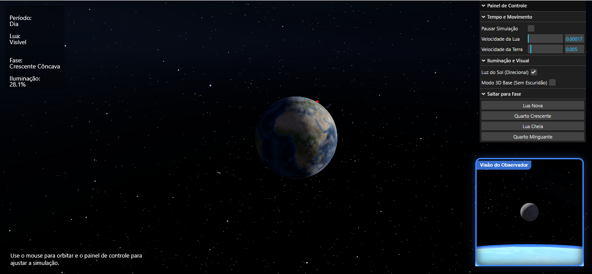

# Simulador das Fases da Lua 3D

# Simulador das Fases da Lua 3D

<p align="center">
  
</p>

## Descrição:

O Simulador das Fases da Lua é uma aplicação web interativa desenvolvida com JavaScript e Three.js que representa o sistema Terra–Lua–Sol em um ambiente tridimensional. O projeto permite visualizar de forma dinâmica as fases da Lua, iluminação lunar, rotação da Terra e visibilidade da Lua a partir de um observador terrestre.

A aplicação executa diretamente no navegador utilizando renderização WebGL em tempo real.

---

# Funcionalidades:

* Simulação orbital da Lua
* Rotação terrestre dinâmica
* Cálculo das fases da Lua
* Exibição da porcentagem de iluminação lunar
* Verificação da visibilidade da Lua
* Controle livre de câmera
* Sombras em tempo real
* Interface gráfica de controle
* HUD com informações astronômicas
* Controle de tempo astronômico
* Sistema de observador terrestre
* Controle livre de câmera
* Câmera do ponto de vista do observador
* Sistema de atmosfera terrestre
* Céu estrelado dinâmico
* Satélites orbitando a Terra
* Importação de modelos 3D externos `.glb`

---

# Tecnologias Utilizadas:

* JavaScript (ES Modules)
* HTML5
* CSS3
* Three.js
* OrbitControls
* GLTFLoader
* UnrealBloomPass
* EffectComposer
* RenderPass
* lil-gui
* WebGL

---

# Recursos de Computação Gráfica:

## Iluminação Composta:

O projeto utiliza múltiplas fontes de luz para aumentar o realismo visual:

* `DirectionalLight` representando o Sol
* `AmbientLight`
* `HemisphereLight`
* Sombras dinâmicas
* Correção de cores (`SRGBColorSpace`).

---

## Materiais e Texturas:

Foram utilizados materiais PBR (`MeshStandardMaterial`) com texturas aplicadas sobre:

* Terra
* Lua

Isso proporciona melhor resposta à iluminação da cena.

# Atmosfera Terrestre:

Foi implementado um sistema de atmosfera utilizando o módulo `atmosphere.js`:

Esse sistema adiciona:

* Brilho atmosférico;
* Camada visual externa;
* Movimentação de nuvens.

# Céu Estrelado:

O projeto implementa um sistema de estrelas através de `stars.js`:

O céu estrelado possui:

* Animação;
* Cintilação;
* Movimentação espacial;
* Sensação de profundidade.

---

## Interatividade:

O usuário pode:

* Movimentar a câmera;
* Alterar parâmetros da simulação;
* Ligar/desligar o Sol;
* Ativar/desativar sombras;
* Observar a cena livremente em 3D.

---

## Modelos 3D Externos:

O projeto utiliza importação de modelos `.glb` através de `GLTFLoader`.

Foi adicionados dois satélites espaciais (`satellite.glb`) integrados à cena tridimensional.

Estrutura:

```txt id="1xbql0"
assets/
└── models/
    └── satellite.glb
```

---

# Como Executar:

## 1. Clone o repositório:

```bash id="lcfrjlwm"
git clone <https://github.com/Felype-byte/COMPUTACAO_GRAFICA.git>
```

---

## 2. Acesse a pasta do projeto:

```bash id="1xajwa"
cd COMPUTACAO_GRAFICA
```

---

## 3. Execute um servidor local:

Recomenda-se utilizar:

* Live Server (VS Code)
* Vite
* http-server

---

## 4. Abra no navegador:

Exemplo:

```txt id="uavjlwm"
http://localhost:5500
```

---

# Controles:

| Controle       | Função                            |
| -------------- | --------------------------------- |
| Mouse          | Rotacionar câmera                 |
| Scroll         | Zoom                              |
| Painel lateral | Ajustar parâmetros                |
| Luz do Sol     | Liga/desliga iluminação solar     |
| Modo 3D Base   | Ativa/desativa a escuridão        |
| Saltar fases   | Posiciona as devidas fases da lua |

---

# Interface:

A HUD exibe informações astronômicas em tempo real:

* Período do dia;
* Visibilidade da Lua;
* Fase lunar;
* Porcentagem iluminada.

---

# Objetivo Educacional:

O projeto foi desenvolvido com foco educacional e em computação gráfica, permitindo demonstrar:

* Fases da Lua;
* Iluminação astronômica;
* Movimento orbital;
* Renderização 3D;
* Materiais PBR;
* Iluminação composta;
* Importação de modelos externos.
